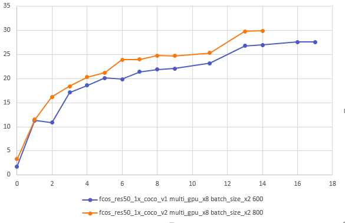
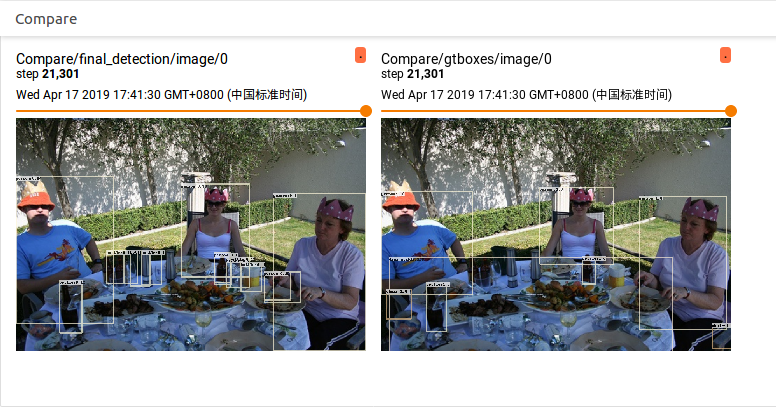

# FCOS: Fully Convolutional One-Stage Object Detection     

## Problem
It can be seen from the tensorboard that the classification ability of the model is particularly poor and the score is relatively low. There may be a problem with the focal loss, and I am still looking for the cause.

## Note
**A [development version](https://github.com/DetectionTeamUCAS/FCOS_Tensorflow) based on Tensorflow.**   

## Abstract
This is a tensorflow re-implementation of [FCOS: Fully Convolutional One-Stage Object Detection](https://arxiv.org/abs/1904.01355), and completed by [YangXue](https://github.com/yangxue0827).     

## COCO
|Model|Backbone|Train Schedule|GPU|Image/GPU|FP16|Box AP|
|-----|--------|--------------|---|---------|----|---------------|
|FCOS (ours)|R50v1|1X|8X GeForce RTX 2080 Ti|2|no|-|

         

## My Development Environment
1、python3.5 (anaconda recommend)             
2、cuda9.0                     
3、[opencv(cv2)](https://pypi.org/project/opencv-python/)    
4、[tfplot](https://github.com/wookayin/tensorflow-plot)             
5、tensorflow >= 1.12                   

## Download Model
Please download [resnet50_v1](http://download.tensorflow.org/models/resnet_v1_50_2016_08_28.tar.gz)、[resnet101_v1](http://download.tensorflow.org/models/resnet_v1_101_2016_08_28.tar.gz) pre-trained models on Imagenet, put it to $PATH_ROOT/data/pretrained_weights.         

## Data Format
```
├── VOCdevkit
│   ├── VOCdevkit_train
│       ├── Annotation
│       ├── JPEGImages
│   ├── VOCdevkit_test
│       ├── Annotation
│       ├── JPEGImages
```

## Compile
```  
cd $PATH_ROOT/libs/box_utils/cython_utils
python setup.py build_ext --inplace
```

## Demo

**Select a configuration file in the folder ($PATH_ROOT/libs/configs/) and copy its contents into cfgs.py, then download the corresponding [weights](https://github.com/DetectionTeamUCAS/Models/tree/master/FCOS_Tensorflow).**      

```   
cd $PATH_ROOT/tools
python inference.py --data_dir='/PATH/TO/IMAGES/' 
                    --save_dir='/PATH/TO/SAVE/RESULTS/' 
                    --GPU='0'
```

## Eval
```  
cd $PATH_ROOT/tools
python eval.py --eval_imgs='/PATH/TO/IMAGES/'  
               --annotation_dir='/PATH/TO/TEST/ANNOTATION/'
               --GPU='0'
```

## Train

1、If you want to train your own data, please note:  
```     
(1) Modify parameters (such as CLASS_NUM, DATASET_NAME, VERSION, etc.) in $PATH_ROOT/libs/configs/cfgs.py
(2) Add category information in $PATH_ROOT/libs/label_name_dict/lable_dict.py     
(3) Add data_name to line 76 of $PATH_ROOT/data/io/read_tfrecord.py 
```     

2、make tfrecord
```  
cd $PATH_ROOT/data/io/  
python convert_data_to_tfrecord.py --VOC_dir='/PATH/TO/VOCdevkit/VOCdevkit_train/' 
                                   --xml_dir='Annotation'
                                   --image_dir='JPEGImages'
                                   --save_name='train' 
                                   --img_format='.jpg' 
                                   --dataset='pascal'
```     

3、train
```  
cd $PATH_ROOT/tools
python train.py
```

4、multi-gpu train
```  
cd $PATH_ROOT/tools
python multi_gpu_train.py
```

## Tensorboard
```  
cd $PATH_ROOT/output/summary
tensorboard --logdir=.
``` 



## Reference
1、https://github.com/endernewton/tf-faster-rcnn   
2、https://github.com/zengarden/light_head_rcnn   
3、https://github.com/tensorflow/models/tree/master/research/object_detection        
4、https://github.com/CharlesShang/FastMaskRCNN       
5、https://github.com/matterport/Mask_RCNN      
6、https://github.com/msracver/Deformable-ConvNets         
